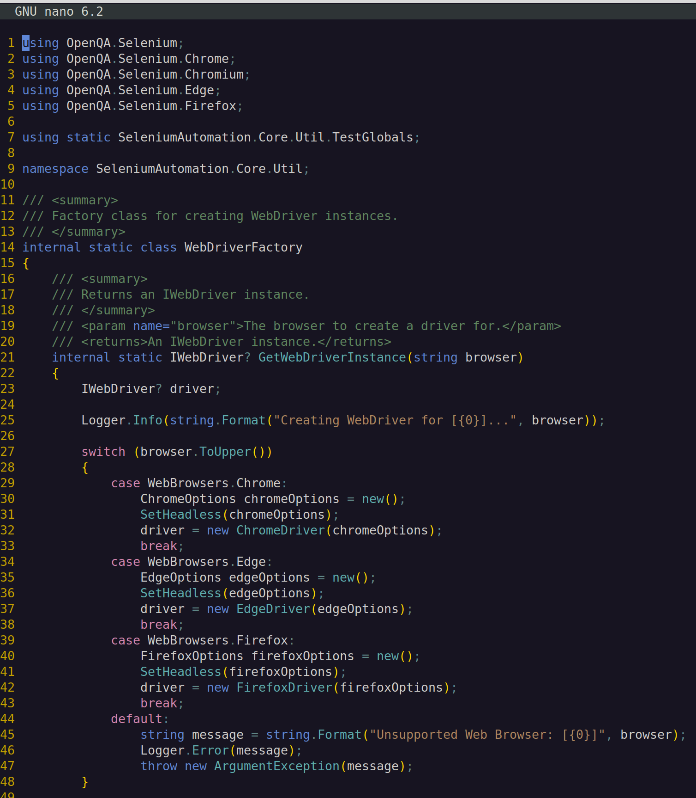

# Syntax Files for the nano Text Editor

## Table of Contents

1. [Overview](#Overview)
2. [Regex Evaluation](#Regex-Evaluation)
3. [Available Colors](#Available-Colors)
4. [Including in nano](#Including-in-nano)
5. [Screenshots](#Screenshots)
6. [Undocumented Features](#Undocumented-Features)

### Overview

This repository contains syntax configuration files for the nano text editor. They can be downloaded as files or the
contents can be copy/pasted into an existing configuration file. The following document provides information on how a
syntax file is set up.

### Regex Evaluation

Syntax files are a series of colors bound to regular expressions that are evaluated top-down. That means expressions
defined later in a file will override previous definitions if there is more than one match. To span multiple lines,
comments for example, you can provide a `start` expression and an `end` expression. A color consists of a foreground and
background separated by a comma. Only one color needs to be provided.

**Examples:**

```
color FG "regex"
color FG start="regex" end="regex"
color FG,BG "regex"
color ,BG start="regex" end="regex"
```

### Available Colors

The following colors are available:

**Standard:**
`black, blue, cyan, green, magenta, red, white, yellow`

The standard colors can be prefixed with `light` and `bright`.

`light` = A lighter version of the color.

`bright` = A lighter and bolder version of the color.

**Aliases:**
`gray/grey = lightblack`

**Other colors:**
`beet, brick, brown, crimson, lagoon, latte, lime, mauve, mint, normal, ocher, orange, peach, pink, plum, purple, rosy,
sage, sand, sea, sky, slate, tawny, teal`

The color may also be a three-digit hexadecimal number prefixed with #.

**Examples:**

```
# Unicode:
color #B87 "'\\[ux][0-9a-fA-F]{4}'"

# Reminders (define after comments):
color brightred "\<(FIXME)\>"
color brightblue "\<(TODO)\>"

# Trailing whitespace (define last):
color ,blue "[[:space:]]+$"
```

### Including in nano

To use a custom syntax file with nano, `include` the file in the nano configuration file, which is usually a file
named `.nanorc` located in the `${HOME}` directory.

**Example:**

```
include /usr/share/nano/*.nanorc
include ${PATH_TO_CUSTOM_FILE}/csharp-dark.nanorc

set autoindent
...
```

### Screenshots

**C# (Dark)**



**Java (Dark)**


### Undocumented Features

- `"""` inside comments will highlight everything outside the comments as a text block unless there is a
  terminating `"""` in the comments.
